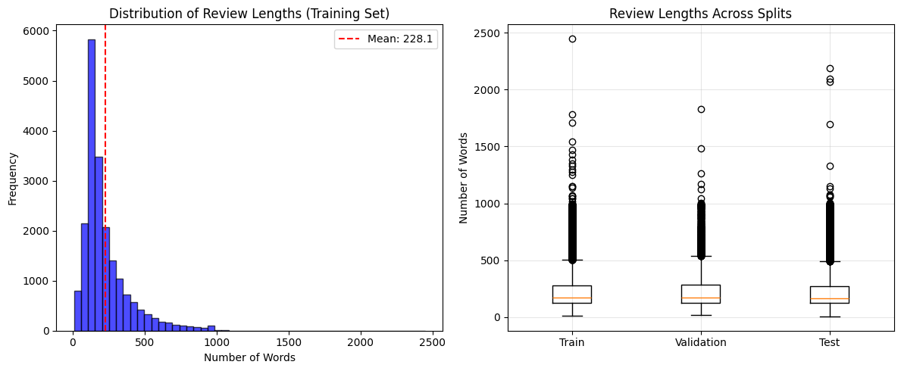
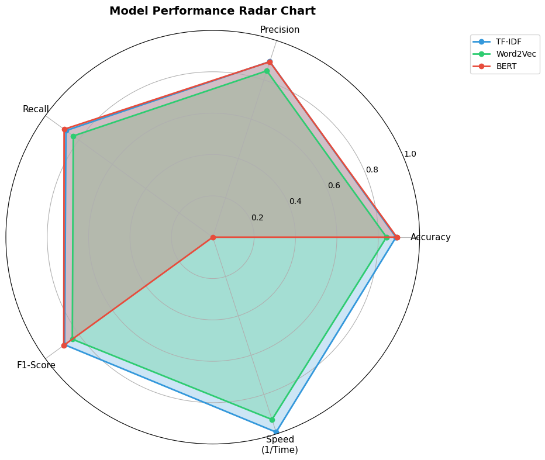
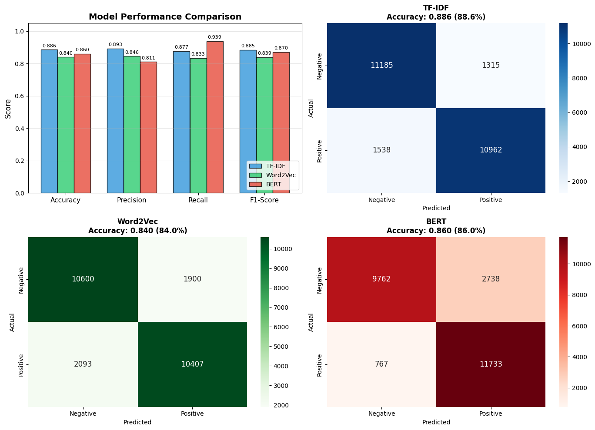

# Sentiment Analysis on IMDB Movie Reviews: A Comparative Study

This project explores the evolution of NLP techniques by comparing three distinct text representation methods—**TF-IDF**, **Word2Vec**, and **BERT**—on a dataset of 50,000 IMDB movie reviews. 

The core objective was to analyze the trade-offs between computational efficiency and classification accuracy in a real-world sentiment analysis pipeline.

## 📊 Key Findings
Based on the experimental results, **TF-IDF** remains a formidable baseline, while **BERT** provides superior recall for complex sentiment patterns.

| Model | Accuracy | Precision | Recall | F1-Score | Speed (1/Time) |
| :--- | :--- | :--- | :--- | :--- | :--- |
| **BERT** | 86.0% | 0.811 | **0.939** | 0.870 | Lowest |
| **TF-IDF** | **88.6%** | **0.893** | 0.877 | **0.885** | **Highest** |
| **Word2Vec** | 84.0% | 0.846 | 0.833 | 0.839 | Medium |

## 🛠️ Project Architecture

### 1. Exploratory Data Analysis (EDA)
Analysis of the training set revealed a mean review length of **228.1 words**. The review lengths are consistent across training, validation, and test splits, ensuring a reliable evaluation framework.

### 2. Modeling Approaches
* **TF-IDF + Logistic Regression:** Utilizes statistical frequency. It achieved the highest overall precision, proving excellent for clearly defined sentiment.
* **Word2Vec (Average Embeddings):** Represents reviews through aggregated word vectors. While capturing semantic meaning, it suffered from the loss of word order.
* **BERT (Fine-tuned):** Leveraging a transformer architecture, BERT achieved the highest Recall (0.939), identifying positive reviews that simpler models missed.

## 📈 Performance Visualization

### Model Performance Radar
The radar chart highlights the massive trade-off between **Speed** and **Predictive Power**. While BERT dominates in Recall, TF-IDF dominates in Efficiency (Speed) and Precision.

### Confusion Matrices
The confusion matrices show that BERT has a slight bias toward predicting the positive class (high True Positives, but higher False Positives compared to TF-IDF).

## 📁 Repository Structure
* `IMDB_Sentiment_Analysis.ipynb`: Main implementation notebook.
* `Sentiment Analysis on IMDB Movie Reviews.pdf`: Detailed project report.
* `Transformers Papers.pdf`: Academic reference for the BERT architecture.
* `1.png`, `2.png`, `3.png`: Performance visualizations used in this README.

## ⚙️ Tech Stack
* **NLP:** Hugging Face Transformers, Gensim (Word2Vec), Scikit-learn
* **Deep Learning:** PyTorch
* **Visualization:** Matplotlib, Seaborn
* **Environment:** Google Colab (GPU Accelerated)

---
**Author:** Forkan Amin Shaon  
**Background:** B.Sc. in Applied Mathematics | M.Sc. in Data Science (Candidate)  
**Goal:** Transforming raw data into intelligent business insights.
